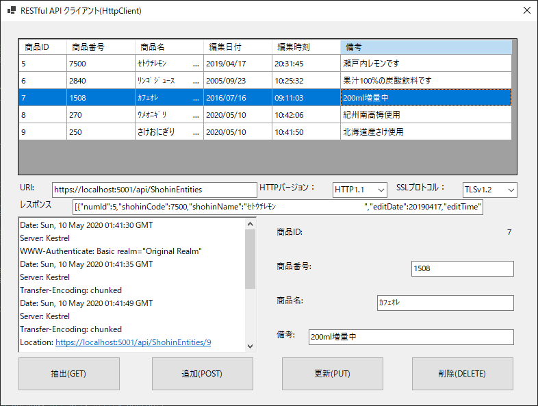
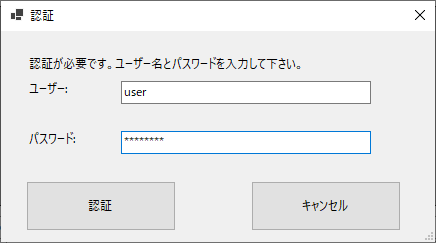
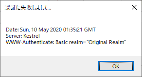

### :computer: JSON形式でHTTPS通信するRESTクライアント(WindowsForms)
___
#### 環境
```
開発環境：Microsoft Visual Studio 2019 Community Edition 16.7.2  
フレームワーク：.NET Core 3.1.7  
デベロッパーパック：.NET Core SDK 3.1.401  
言語：C#.NET 8.0  
デスクトップ：Windows Forms  
NuGetライブラリー：Microsoft.Extensions.DependencyInjection 3.1.7  
		   Microsoft.Extensions.Http 3.1.7  

```

#### 画面イメージ  
  

#### 認証画面  
  

#### 認証失敗時  
  